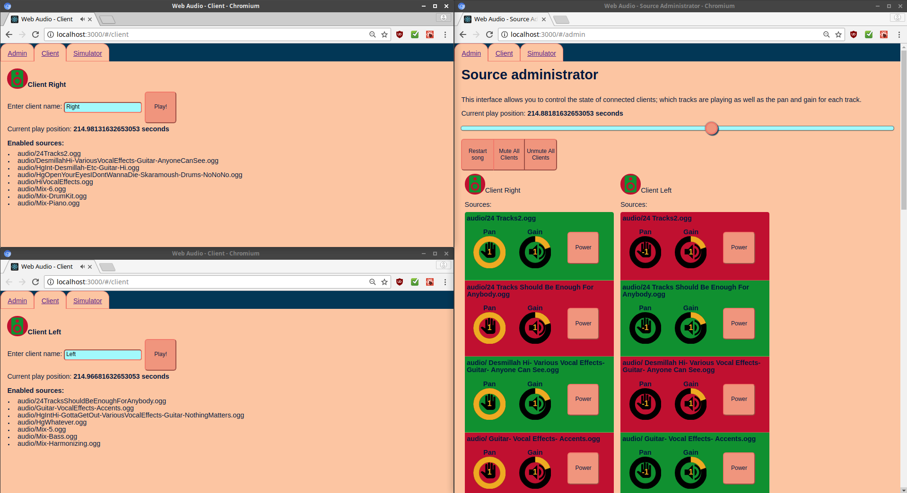

web-audio-stream-sync
=====================

Takes multiple OGG files, and allows remotely playing them with different pan and gain settings on different clients.



The original intent of this application was to play every track of Bohemian Rhapsody on a separate speaker. If you want to try doing that, you might want to look at https://queenpoland.wordpress.com/download/queen-multitracks/ . You will need to split MOGGs into OGGs with a tool like Audacity. If you use Audacity, the option is in the menu under File > Export > Export Multiple...

Prerequisites
---------------------------

* node v10.0.0
* yarn 1.6.0
* npm 5.6.0
* Chrome 66

You may be able to use newer or older versions of these components, but this is not guaranteed to work.

Running
----------------------------

1. Create a folder at /frontend/public/audio and save your OGG audio files there. They should all be the same length.
2. Copy the file /.env.sample to /.env. Change the `AUDIO_FILES_ARRAY` to include your files. If you do not create this file, it will be generated automatically.
3. Run the following commands: 
```sh
yarn install
yarn run start
```
4. Navigate to http://localhost:3000 with Chrome. The app should be running.
5. Open as many clients as you want, on as many computers as you want, then open the admin page in a new Chrome tab.
6. Paste the admin password (Look at the console where you did `yarn run start` for a line that looks like `ADMIN PASSWORD: xxx`) into the box, and click submit.

An interface will appear, allowing you to control the sources playing on each client individually. If you name the clients using the client name box, the client's settings will be saved to `storage.json` using that name, and will be recalled any time you enter that name, even if you restart the server.
